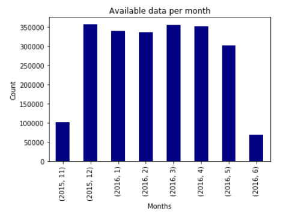

# Manila Traffic

Logs of MMDA traffic status reports from November 2015 to June 2016.

I have been logging data from the http://mmdatraffic.interaksyon.com site before it went down. Here's is a flattened/cleaned-up version of the logs I was able to save.

The full dataset is in tar.gz, so I included a sample file containing the first 100 lines: [manila-traffic-sample.csv](manila-traffic-sample.csv).

